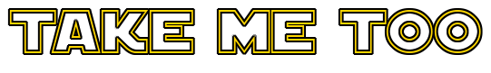

  

## Inspiration
Space travel is something that has always excited and inspired us since childhood. With technological advancements and feasibility in this sector growing, the future in which common people get to experience space is not far. Hence, we can very well look forward to space tourism being a hot business in the upcoming decades. Another huge inspiration for this project has been, **Elon Musk**. We look forward and try to make his vision for **_'Anyone' can move to Mars and beyond_** come true.

## What it does
Our web-app promotes space tourism. It is a futuristic application which will allow the masses to experience space like never before. Through this application, we connect you to agencies like NASA, ISRO, SpaceX, etc. and learn more about space travel opportunities and packages offered. It's your Booking.com for space travel, with a user-friendly interface to easily access the following services:
- 👨‍🚀 Space Experiences (e.g. Moon Walk, Space Jump)
- 🚀 Flights to the Expanse (e.g. Moon, ISS)
- 🪐 Stays in the Outer Space

## How we built it
Our web - app is based on reactJS frontend and node.js backend. Firebase is used for user authentication and data storage. Google maps-moon API was used to display the exact locations of the place of stay at the moon. The google maps API was mounted upon NASA's API. We made use of it to retrieve launch information and other details as well. We have integrated a virtual assistant **Dr. Luna**👩‍🚀, to help users navigate throughout the website without any trouble. This virtual assistant is powered with Dialogflow.

## Challenges we ran into
The most challenging part was to use the google maps - moon API. Since it's not something people work with every now and then, we couldn't find any good resources or documentation to get desired results. But thank god of NASA's moon trek embeds. This is built using google maps and NASA's information that gave us the most optimum solution to our problem.

On the whole, this idea depends on future advancement in space tourism, which, in the current scenario is decades away. There have been a lot of hypothetical assumptions made during this project. But that's the beauty that technology covers. It makes us prepared for the future. 

## Accomplishments that we're proud of
We proudly present you version 1 of our website. We never thought we will be able to pull off the whole prototype of our idea. We hope space travel becomes open to all and this website helps you to book your dream vacation. 

## What we learned
Through this hack, we got the opportunity to learn a lot of technologies. Key points are:
- 💻 React JS and its various libraries
- 🗺 Google Maps API and NASA API integration
- 👩‍🚀 Chatbot Development through Dialogflow
- 👩🏽‍🤝‍🧑🏻 Team Work
- ⏱ Working on a deadline
- ✨ most importantly **SO MUCH ABOUT SPACE**

## What's next for Take Me Too
With advancement in space technology, the day is not far where more options and features will be added to our website. As we uncover the universe more, opportunities to explore also increase. And for that you will always have takemetoo.space to reach out and fulfill your inter galactic dreams and aspirations.
